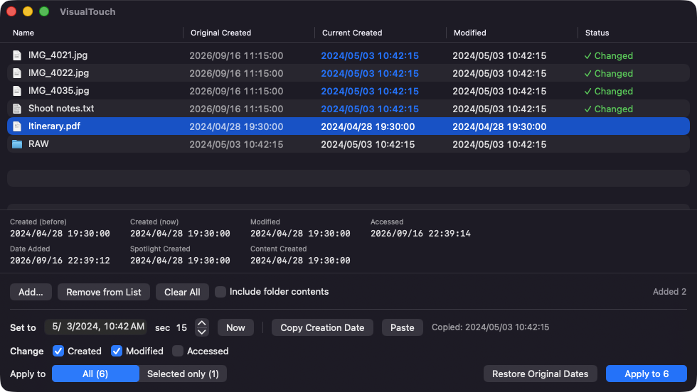

# VisualTouch

[日本語](README.md)

Change a file's **creation date** (birthtime), modification date and access date on macOS. An extension of `touch`:
it sets the one date `touch` can't, and applies to many files and whole folder trees at once.

- **VisualTouch.app** — drag & drop GUI
- **vtouch** — bundled command line tool (`touch`-compatible `-t`, plus `rm`-style `-r` / `-f` / `-i` / `-v`)



## Install

### Download

Grab `VisualTouch-<version>.zip` from [Releases](https://github.com/yamachan03/VisualTouch/releases), unzip, and move
`VisualTouch.app` wherever you like. It is signed with a Developer ID and notarized by Apple, so it opens without
Gatekeeper warnings.

To get the `vtouch` command, choose **VisualTouch → Install Command Line Tool “vtouch”…** from the app menu.
It copies the tool to `/usr/local/bin`, which is already on the default `PATH`.

### Build from source

Requires Xcode or the Command Line Tools. No third-party dependencies.

```bash
git clone https://github.com/yamachan03/VisualTouch.git
cd VisualTouch
./build.sh          # builds VisualTouch.app (with vtouch inside)
./install-cli.sh    # optional: copies vtouch to /usr/local/bin
```

macOS 13 or later. The binary targets the CPU architecture of the machine that builds it.

## The dates macOS keeps

| Shown as | What it is | VisualTouch |
|---|---|---|
| Created | `st_birthtime` — what Finder calls “Created” | can change |
| Modified | `st_mtime` | can change |
| Accessed | `st_atime` | can change |
| Date Added | when the file was added to its folder | display only |
| Content Created | metadata inside the file, e.g. a photo's capture date | display only |

The list shows **Original Created** (as it was when you added the file) next to **Current Created**, so you can see
before and after in one place. After writing, the app re-reads the file and reports if the date did not actually change.

## GUI

1. Open `VisualTouch.app`
2. Drag & drop files or folders (many at once, or use **Add…**)
3. Pick the date, time and seconds under **Set to**
4. Tick which dates to change (Created / Modified / Accessed)
5. Choose **All** or **Selected only**, then **Apply** (⌘Return)

### Copy & paste a date

When editing a file resets its creation date:

1. Add the original file, select it, **Copy Creation Date** (⌘C) → `2024/05/03 10:42:15` goes to the clipboard
2. Edit and save the file
3. Add it again, **Paste** (⌘V) fills the date picker
4. Tick **Created** and apply

Paste understands `2026/08/31 06:40:55`, `2026-08-31T06:40:55Z`, `2026年8月31日 6:40`, `2001/03/04` and similar.
Right-click a row for **Copy Creation Date / Copy Modification Date / Show in Finder**.
**Restore Original Dates** puts back the dates recorded when the files were added.

## vtouch

```
vtouch [options] <file or folder>...

Date (pick one; default is now):
  -t STAMP            touch-compatible [[CC]YY]MMDDhhmm[.SS]   e.g. -t 202608310640.55
  -d DATETIME         "2026/08/31 06:40:55", "2026-08-31T06:40", "2026-08-31" ...
  --reference FILE    copy FILE's creation / modification / access dates

Which dates (default: all three):
  -b  creation (birthtime)    -m  modification    -a  access

Targets (rm-style):
  -r, -R   recurse into folders
  -H       include hidden files when recursing
  -f       ignore missing paths and errors; exit 0 anyway
  -i       confirm each file
  -c       do not create missing files (by default, like touch, an empty file is created)

Other:
  -l       list dates only, change nothing
  -n       dry run — show what would change
  -v       print each file as it is changed
  -h, --help, -help   this help
  --version, -version version
```

Help and messages are in English unless `LANG` / `LC_ALL` or the system language is Japanese.

```bash
vtouch -r -t 202001010000 ~/Pictures/Trip         # whole folder tree → 2020-01-01 00:00
vtouch -b -d "2026/08/31 06:40:55" Report.pages     # creation date only
vtouch -r --reference original.txt edited/          # copy original.txt's dates onto edited/ and everything inside
vtouch -rn -t 202001010000 ~/Documents             # dry run first
vtouch -rl ~/Documents                             # just list the dates
```

- Like `touch`, a missing file is created empty. `-c` prevents that; `-l` and `-n` never create.
- `touch -r FILE` is `--reference FILE` here, because `-r` means recurse as in `rm`.
- Recursion goes deepest-first and does not enter packages (`.app` etc.).
- Every write is verified by re-reading the file. Exit codes: 0 ok, 1 some failures (0 with `-f`), 2 bad arguments.

## Notes

- Files under Desktop, Documents or Downloads trigger the usual macOS permission prompt on first access.
- Modification date is written before creation date; the reverse order can drag the creation date along on some setups.
- Access date is set with `utimes(2)`, writing the current mtime back so it is not disturbed. atime is not verified,
  since merely reading a file can change it.
- Read-only volumes and files you lack write permission for cannot be changed; the reason appears in the Status column.

## License

MIT
