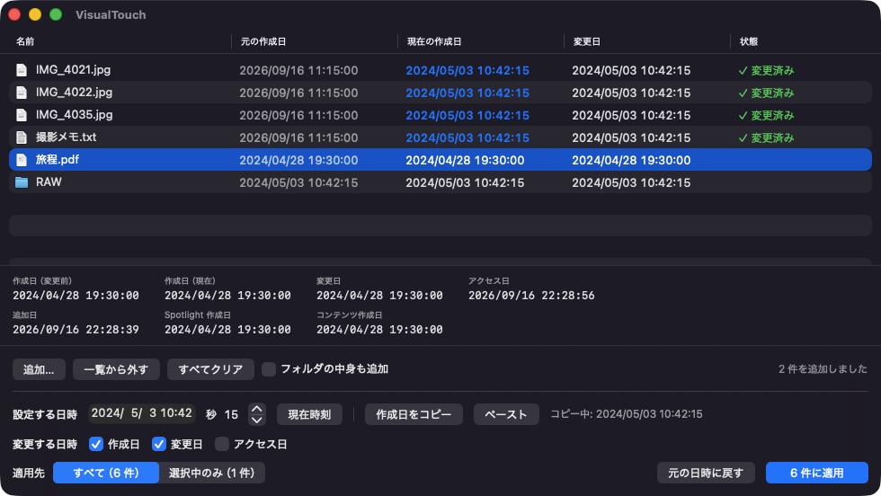

# VisualTouch

[English](README.en.md)

ファイルの **作成日 / 変更日 / アクセス日** を書き換える macOS アプリ。`touch` の拡張です。
`touch` では変更できない「作成日（birthtime）」を、複数ファイル・サブフォルダの中までまとめて適用できます。

- **VisualTouch.app** — ドラッグ＆ドロップで使う GUI
- **vtouch** — 同梱のコマンドラインツール（`touch` 互換の `-t` に加え、`rm` 風の `-r` / `-f` / `-i` / `-v`）



## インストール

### ダウンロードする

[Releases](https://github.com/yamachan03/VisualTouch/releases) から `VisualTouch-<version>.zip` を取得して展開し、
`VisualTouch.app` をアプリケーションフォルダなどに置きます。Developer ID 署名と Apple の公証を通してあるので、
Gatekeeper の警告なしにそのまま開けます。

vtouch コマンドも使うなら、アプリのメニュー **VisualTouch → コマンドラインツール「vtouch」をインストール…** を選びます。

### ソースからビルドする

Xcode（または Command Line Tools）が入っていれば、外部依存なしでビルドできます。

```bash
git clone https://github.com/yamachan03/VisualTouch.git
cd VisualTouch
./build.sh          # VisualTouch.app を作る
./install-cli.sh    # vtouch を /usr/local/bin に入れる（任意）
```

動作環境: macOS 13 以降。ビルドしたマシンの CPU アーキテクチャ向けのバイナリになります。

## Mac の「作成日」について

macOS は 1 つのファイルに複数の日時を持っています。本アプリが扱うのは上の 3 つで、
下の 2 つは表示のみ（変更しません）。

| 表示名 | 実体 | 本アプリ |
|---|---|---|
| 作成日 | `st_birthtime`（Finder の「作成日」） | 変更できる |
| 変更日 | `st_mtime` | 変更できる |
| アクセス日 | `st_atime` | 変更できる |
| 追加日 | このフォルダに追加された日 | 表示のみ |
| コンテンツ作成日 | 写真の撮影日など、ファイル内部のメタデータ | 表示のみ |

一覧には **「元の作成日」（一覧に追加した時点の値）** と **「現在の作成日」** を並べて表示するので、
変更前後が同じ画面で確認できます。書き込み後はディスクから読み直して照合し、
実際に変わっていなければ「作成日を変更できませんでした」と状態列に出します。

## 使い方

1. `VisualTouch.app` を開く
2. ファイルやフォルダをドラッグ＆ドロップ（複数まとめて可 / 「追加…」ボタンからも可）
3. 「設定する日時」で日付・時刻・秒を指定
4. 変更する項目（作成日 / 変更日 / アクセス日）にチェック
5. 適用先を「すべて」か「選択中のみ」で選び、**「N 件に適用」**（⌘Return）

### 日時のコピー＆ペースト

ファイルを編集すると作成日がずれてしまう場合の戻し方：

1. 元のファイルを一覧に入れて選択し、**「作成日をコピー」（⌘C）**
   → `2026/08/31 06:40:55` の形式でクリップボードに入ります
2. ファイルを編集・保存する
3. そのファイルを一覧に入れ、**「ペースト」（⌘V）** で「設定する日時」に流し込む
4. 「作成日」にチェックして適用

- 複数選択してコピーすると `名前<TAB>日時` の一覧としてコピーされます。
- ペーストは `2026/08/31 06:40:55` `2026-08-31T06:40:55Z` `2026年8月31日 6:40` `2001/03/04` などを解釈します。
- 行を右クリックすると「作成日をコピー」「変更日をコピー」「Finder で表示」を選べます。
- 「元の日時に戻す」で、一覧に追加した時点の作成日・変更日へ戻せます。

## コマンドライン: vtouch

### インストール

`vtouch` は `VisualTouch.app/Contents/MacOS/vtouch` に同梱されています。次のどちらかで `/usr/local/bin/vtouch` にコピーします。

- アプリのメニュー **VisualTouch → コマンドラインツール「vtouch」をインストール…**
- ターミナルで `./install-cli.sh`

`/usr/local/bin` は macOS 標準で `/etc/paths` に登録されているため、bash / zsh いずれでもシェル設定を
編集せずにそのまま `vtouch` が使えます（`echo $PATH` に `/usr/local/bin` があれば OK）。
書き込み権限がない環境では管理者パスワードを求められます。
アプリを更新したら同じ手順でもう一度実行すると上書きされます。

### 使い方

```
vtouch [オプション] <ファイル/フォルダ>...

日時（いずれか 1 つ。省略時は現在時刻）:
  -t STAMP            touch 互換の [[CC]YY]MMDDhhmm[.SS]   例: -t 202608310640.55
  -d DATETIME         "2026/08/31 06:40:55" "2026-08-31T06:40" "2026年8月31日" など
  --reference FILE    FILE の作成日／変更日／アクセス日をそのまま写す

変更する日時（省略時は 3 つとも）:
  -b  作成日 (birthtime)    -m  変更日    -a  アクセス日

対象の選び方（rm 風）:
  -r, -R   フォルダの中のファイル／サブフォルダにも再帰して適用
  -H       再帰時に隠しファイル（. で始まる名前）も含める
  -f       存在しないパスやエラーを無視して続行し、終了コードも 0 にする
  -i       1 件ずつ確認してから変更する
  -c       存在しないファイルを作らない（既定では touch と同じく空ファイルを作る）

その他:
  -l       日時を表示するだけで変更しない
  -n       ドライラン（変更せず、対象と日時だけ表示）
  -v       変更したファイルを 1 件ずつ表示
```

```bash
vtouch -r -t 202001010000 ~/Pictures/旅行        # フォルダごと 2020/01/01 00:00 に
vtouch -b -d "2026/08/31 06:40:55" 報告書.pages   # 作成日だけ変更
vtouch -r --reference 元.txt 編集後/              # 元.txt の日時を編集後/ 以下すべてに写す
vtouch -rn -t 202001010000 ~/Documents           # 何が変わるか先に確認（ドライラン）
vtouch -rl ~/Documents                           # 日時を一覧表示するだけ
```

- `touch` と同じく、指定したファイルが無ければ空ファイルを作ります。`-c` で抑止、`-l` / `-n` では作りません。
- `touch -r FILE` に相当するのは `--reference FILE` です（`-r` は rm と同じく再帰に割り当てています）。
- 再帰時は深い階層から順に処理します。パッケージ（.app など）の中には入りません。
- 書き込み後に読み直して検証し、変わっていなければ「作成日を変更できませんでした」と報告します。
- 終了コード: 0 成功 / 1 失敗あり（`-f` なら 0） / 2 引数エラー

## ビルド

```bash
./build.sh        # VisualTouch.app と、その中の vtouch を両方ビルド
./install-cli.sh  # vtouch を /usr/local/bin にコピー
```

`swiftc` のみを使用し、外部ライブラリはありません。実行マシンのアーキテクチャ向けにビルドし、
アドホック署名まで行います。

### 配布用ビルド（Developer ID 署名 + 公証）

```bash
# 初回だけ: 公証用の資格情報をキーチェーンに保存
xcrun notarytool store-credentials VisualTouch \
    --apple-id <Apple ID> --team-id 7JSPUB92B6 --password <App 用パスワード>

./release.sh                    # ビルド → 署名 → 公証 → ステープル → VisualTouch-<ver>.zip
SKIP_NOTARIZE=1 ./release.sh    # 署名だけ試す
```

公証まで通った zip は、ダウンロードした人の Mac でそのまま開けます（Gatekeeper の警告なし）。

## 構成

- [Sources/Core/FileDates.swift](Sources/Core/FileDates.swift) — 日時の読み書き・検証（GUI と CLI で共有）
- [Sources/Core/DateText.swift](Sources/Core/DateText.swift) — 日時の文字列化と解釈（`-d` / `-t` / ペースト）
- [Sources/App/VisualTouchApp.swift](Sources/App/VisualTouchApp.swift) — GUI エントリポイントとメニュー
- [Sources/App/ContentView.swift](Sources/App/ContentView.swift) — UI
- [Sources/App/FileStore.swift](Sources/App/FileStore.swift) — 一覧管理と適用
- [Sources/App/DateClipboard.swift](Sources/App/DateClipboard.swift) — クリップボード
- [Sources/App/CLIInstaller.swift](Sources/App/CLIInstaller.swift) — メニューからの vtouch インストール
- [Sources/CLI/main.swift](Sources/CLI/main.swift) — vtouch
- [Info.plist](Info.plist) / [build.sh](build.sh) / [install-cli.sh](install-cli.sh)

## 注意

- デスクトップ・書類・ダウンロード内のファイルを扱うと、初回にアクセス許可のダイアログが出ます。
- 変更日 → 作成日 の順に書き込みます（逆順だと作成日が変更日に引きずられる環境があるため）。
- アクセス日は `utimes(2)` で設定し、現在の変更日を書き戻して巻き添えを防いでいます。
  ただし atime は読み取りだけでも OS が書き換えるため、検証対象から外しています。
- 書き込み権限のないファイルや読み取り専用ボリューム上のファイルは変更できません（理由が状態列に出ます）。

## ライセンス

MIT
